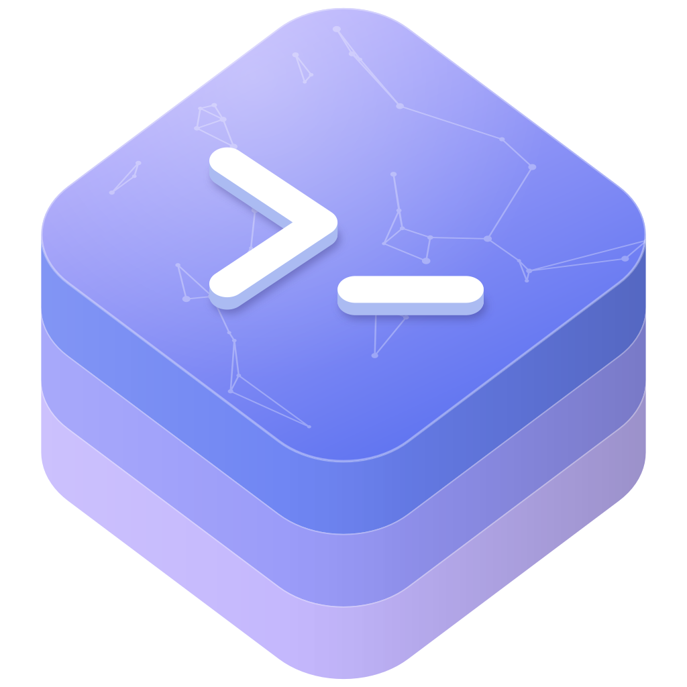

<p align="center">
  
</p>

<h1 align="center">swift-codex</h1>

<p align="center">
  Swift interfaces for the OpenAI Codex CLI through its exec, App Server, and MCP protocols.
</p>

<p align="center">
  <a href="https://github.com/swift-library/swift-codex/actions/workflows/swift-package.yml"></a>
  
  
  <a href="LICENSE"></a>
</p>

[Overview](#overview) · [Install](#install) · [Quick start](#quick-start) ·
[Products](#products) · [Usage](#usage) · [Requirements](#requirements) ·
[Documentation](#documentation) · [Contributing](#contributing) ·
[License](#license)

> [!NOTE]
> swift-codex is pre-1.0. Minor releases may include source-breaking
> changes, so depend on it with `.upToNextMinor(from:)`.

## Overview

swift-codex lets Swift apps and servers work with the OpenAI Codex CLI. It
launches the `codex` executable that you install and speaks each of its
machine interfaces: the JSONL event stream of `codex exec`, the JSON-RPC
protocol of `codex app-server`, and the Model Context Protocol tools of
`codex mcp-server`. Each interface is a separate product, so a target depends
only on the layer it uses.

- `Codex` threads and turns: run a prompt and read the final response, stream
  each event as it arrives, resume a thread, and request structured output
  with a JSON Schema.
- Direct `codex exec` and `codex exec resume` processes with raw stdout lines,
  typed JSONL events, and bounded output capture.
- A typed App Server client whose stable and experimental protocol models are
  generated at build time from a schema pinned to OpenAI Codex CLI 0.154.0.
- App Server transports over stdio, Foundation `URLSession` WebSockets, and
  SwiftNIO WebSockets, plus Vapor and Hummingbird adapters that accept
  downstream WebSocket connections for a gateway.
- An MCP client for `codex mcp-server` with tool calls, server messages,
  approval requests, and cancellation.

## Install

Add the package and the products you use to `Package.swift`:

```swift
dependencies: [
  .package(
    url: "https://github.com/swift-library/swift-codex.git",
    .upToNextMinor(from: "0.4.1")
  ),
],
targets: [
  .target(
    name: "YourTarget",
    dependencies: [
      .product(name: "Codex", package: "swift-codex"),
    ]
  ),
]
```

Depend on the narrowest product for your integration: `CodexExec` for direct
process control, `CodexMCP` for the MCP server, or `CodexAppServerClient` with
one transport, such as `CodexAppServerStdio`, for the App Server. The
[Products](#products) table lists all eleven.

`CodexAppServerProtocol` and `CodexAppServerClient` generate their Swift models
from the vendored protocol schema with a SwiftPM build tool plugin during a
normal build. The generated code is not checked into the repository.

## Quick start

Install the OpenAI Codex CLI and sign in with it first. `Codex` finds `codex`
on `PATH` and runs each turn through `codex exec`:

```swift
import Codex

func summarizeRepository() async throws {
  let codex = Codex()
  let thread = codex.startThread()
  let turn = try await thread.run(.text("Summarize this repository."))

  print(turn.finalResponse)
}
```

`run(_:options:)` waits for the turn to finish and returns a `Turn` with the
final response, the completed items, and token usage. A new thread receives its
`id` from the first `thread.started` event, and later turns on the same
`CodexThread` continue that session.

## Products

| Product | Use it for |
| --- | --- |
| `Codex` | Threads and turns, with buffered and streamed runs |
| `CodexExec` | `codex exec` and `codex exec resume` processes and JSONL decoding |
| `CodexAppServerClient` | Typed App Server calls, notifications, server requests, and connection lifecycle |
| `CodexAppServerProtocol` | Generated stable and experimental App Server protocol models |
| `CodexAppServerRuntime` | The message transport protocol and raw JSON-RPC envelopes |
| `CodexAppServerStdio` | A local `codex app-server --listen stdio://` process transport |
| `CodexAppServerURLSession` | A Foundation `URLSession` WebSocket client transport |
| `CodexAppServerNIO` | A SwiftNIO WebSocket client transport |
| `CodexAppServerVapor` | A Vapor adapter that accepts downstream WebSocket connections |
| `CodexAppServerHummingbird` | A Hummingbird adapter that accepts downstream WebSocket connections |
| `CodexMCP` | `codex mcp-server` tool calls, server messages, approvals, and cancellation |

There is no umbrella `CodexAppServer` product. A local client combines
`CodexAppServerClient` with one client transport. A gateway combines a Vapor
or Hummingbird adapter with an upstream transport through
`CodexAppServerRuntime`.

## Usage

### Stream events

`runStreamed(_:options:)` returns the turn's events in order, without
buffering them:

```swift
import Codex

func streamTurn() async throws {
  let thread = Codex().startThread()
  let streamedTurn = try await thread.runStreamed(.text("Inspect the test suite."))

  for try await event in streamedTurn {
    switch event {
    case .threadStarted(let id):
      print("thread:", id)
    case .itemCompleted(let item):
      print("item:", item)
    case .turnCompleted(let usage):
      print("output tokens:", usage.outputTokens)
    case .turnFailed(let error):
      print("failed:", error.message)
    default:
      break
    }
  }
}
```

`ThreadEvent`, `ThreadItem`, `Usage`, and `ThreadError` are aliases for the
`CodexExec` event models, so both products share one protocol model.

### Configure and resume threads

`CodexOptions` configures the client, `ThreadOptions` configures every turn on
a thread, and `TurnOptions` configures a single turn. Values such as the
sandbox mode and approval policy use the CLI's own configuration strings:

```swift
import Codex
import Foundation

func reviewWorkspace() async throws {
  let codex = Codex(options: .init(
    codexPathOverride: URL(fileURLWithPath: "/opt/homebrew/bin/codex")
  ))
  let thread = codex.startThread(options: .init(
    sandboxMode: "read-only",
    workingDirectory: URL(fileURLWithPath: "/path/to/workspace"),
    skipGitRepoCheck: true
  ))

  let first = try await thread.run(.text("Review the current diff."))
  print(first.finalResponse)

  if let id = thread.id {
    let resumed = codex.resumeThread(id)
    let followUp = try await resumed.run(.text("List the riskiest change."))
    print(followUp.finalResponse)
  }
}
```

`ThreadOptions` also sets the model, reasoning effort, network access, web
search mode, and additional writable directories. `CodexOptions` sets an API
key, a base URL, configuration overrides, and a replacement environment for the
launched process. `Input.items(_:)` combines text with local images.

### Request structured output

Pass a JSON Schema in `TurnOptions` to constrain the final response:

```swift
import Codex

func summarizeAsJSON() async throws {
  let schema: CodexConfigObject = [
    "type": .string("object"),
    "properties": .object([
      "summary": .object(["type": .string("string")])
    ]),
    "required": .array([.string("summary")]),
    "additionalProperties": .bool(false),
  ]

  let thread = Codex().startThread()
  let turn = try await thread.run(
    .text("Summarize Package.swift."),
    options: .init(outputSchema: schema)
  )
  print(turn.finalResponse)
}
```

### Run `codex exec` directly

`CodexExec` maps requests onto the `codex exec` command line and returns a
process handle. Read `stdoutLines` as plain text, or decode them with
`CodexExecJSONLDecoder` in JSONL mode. Always await `waitForTermination()`,
even after a stream error, so the process is cleaned up and its exit status and
stderr are available:

```swift
import CodexExec

func runExec() async throws {
  let client = CodexExecClient()
  let handle = try await client.run(.init(
    promptInput: .text("Inspect Package.swift."),
    outputMode: .jsonl,
    options: .init(ignoreUserConfig: true, sandboxMode: "read-only")
  ))

  do {
    for try await event in CodexExecJSONLDecoder().decode(handle.stdoutLines) {
      print(event)
    }
  } catch {
    _ = try? await handle.waitForTermination()
    throw error
  }

  let termination = try await handle.waitForTermination()
  print(termination.exitInterpretation)
}
```

`ignoreUserConfig` maps to `--ignore-user-config`. It keeps the user's
`config.toml` models, MCP servers, and hooks out of the request while still
using `CODEX_HOME` for authentication. Resume a session with
`client.resume(_:)` and a `.sessionID(_:)`, `.last`, or `.lastAll` selector.

Capture is bounded. By default `CodexExecLaunchConfiguration.outputLimits`
retains 8 MiB and 65,536 complete lines of stdout and 1 MiB of stderr. Output
beyond a limit ends the stream with `CodexExecError.outputCaptureLimitExceeded`,
which carries the retained output and the dropped byte counts.

### Connect to the App Server

`CodexAppServerClient` performs the `initialize` handshake over a transport you
provide and returns a `CodexAppServerConnection` with typed methods:

```swift
import CodexAppServerClient
import CodexAppServerProtocol
import CodexAppServerStdio

func listModels() async throws {
  let client = CodexAppServerClient(
    sessionConfiguration: .init(
      clientInfo: .init(name: "my_app", title: "My App", version: "1.0.0")
    ),
    transportFactory: { try CodexAppServerStdioTransport() }
  )
  let connection = try await client.start()

  do {
    let response = try await connection.modelList(.init())
    for model in response.data {
      print(model.id)
    }
  } catch {
    await connection.close()
    throw error
  }
  await connection.close()
}
```

Typed methods cover threads and turns, reviews, command execution, the file
system, configuration, models, accounts, MCP servers, apps and skills, and
experimental realtime APIs. Parameter and result types come from
`CodexAppServerProtocol.Stable` and `CodexAppServerProtocol.Experimental`. Set
`experimentalApi: true` in the session configuration to use experimental
methods. Experimental models follow the pinned experimental schema and do not
carry the stability expectations of the stable namespace.

Each release pins the vendored schema to an exact OpenAI Codex CLI release; the
[schema lock file](Vendor/CodexAppServerProtocolSchema/upstream.lock.json)
records it, and the [method adoption inventory](Documentation/Reference/CodexAppServerMethodAdoption.md)
lists the methods with typed bindings.

### Handle notifications and server requests

A connection streams notifications and requests that the server sends to the
client, such as approval prompts. Answer each request with
`resolveServerRequest(_:with:)` or `rejectServerRequest(_:code:message:data:)`:

```swift
import CodexAppServerClient

func observe(connection: CodexAppServerConnection) async throws {
  for try await notification in connection.notifications {
    print(notification)
  }
}

func handleServerRequests(connection: CodexAppServerConnection) async throws {
  for try await request in connection.typedServerRequests {
    if case .commandExecutionApproval(let handle) = request {
      try await connection.rejectServerRequest(
        handle,
        code: -32603,
        message: "Command approval is not supported by this client."
      )
    }
  }
}
```

To forward fields that the pinned stable model does not include, set
`inboundMessageMode: .raw` and use `rawNotifications`, `rawServerRequests`, and
`sendRawRequest(method:params:)`. Use `.rawOrdered` and `rawInboundMessages`
when your state depends on the combined order of notifications and server
requests. Typed streams finish immediately in raw modes, and raw streams finish
immediately in typed mode.

### Choose an App Server transport

`CodexAppServerStdioTransport` launches `codex app-server --listen stdio://`
and finds `codex` on `PATH` unless you set an executable. Use
`CodexAppServerURLSessionTransport` or `CodexAppServerNIOTransport.connect(url:)`
to reach an App Server WebSocket endpoint instead:

```swift
import CodexAppServerClient
import CodexAppServerStdio
import CodexAppServerURLSession
import Foundation

func connectToExplicitBinary() async throws {
  let process = CodexAppServerStdioConfiguration(
    executableURL: URL(fileURLWithPath: "/opt/homebrew/bin/codex"),
    workingDirectoryURL: URL(fileURLWithPath: "/path/to/workspace")
  )
  let client = CodexAppServerClient(
    sessionConfiguration: .init(
      clientInfo: .init(name: "my_app", version: "1.0.0"),
      experimentalApi: true
    ),
    transportFactory: { try CodexAppServerStdioTransport(configuration: process) }
  )
  let connection = try await client.start()
  await connection.close()
}

func connectToWebSocket(url: URL) async throws {
  let client = CodexAppServerClient(
    sessionConfiguration: .init(clientInfo: .init(name: "my_app", version: "1.0.0")),
    transportFactory: { CodexAppServerURLSessionTransport(url: url) }
  )
  let connection = try await client.start()
  await connection.close()
}
```

### Bridge a WebSocket gateway

`CodexAppServerVapor.webSocket(on:_:onConnect:)` and
`CodexAppServerHummingbird.webSocket(on:_:onConnect:)` register a WebSocket
route and hand each accepted connection to you as a
`CodexAppServerMessageTransport`. A transparent gateway pumps messages between
that downstream transport and an upstream one:

```swift
import CodexAppServerRuntime

func bridge(
  downstream: any CodexAppServerMessageTransport,
  upstream: any CodexAppServerMessageTransport
) async {
  await withTaskGroup(of: Void.self) { group in
    group.addTask { await pump(from: downstream, to: upstream) }
    group.addTask { await pump(from: upstream, to: downstream) }

    _ = await group.next()
    group.cancelAll()
    await downstream.close()
    await upstream.close()
  }
}

private func pump(
  from source: any CodexAppServerMessageTransport,
  to sink: any CodexAppServerMessageTransport
) async {
  do {
    for try await message in source.inboundMessages {
      try await sink.sendMessage(message)
    }
  } catch {
    return
  }
}
```

The adapters only carry WebSocket messages. Authentication, rate limits,
auditing, message policy, and request routing belong to your gateway. Do not
call `CodexAppServerClient.start()` inside a transparent bridge: it performs a
second `initialize` handshake on behalf of the gateway.

### Use the MCP server

`CodexMCPClient` launches `codex mcp-server`, calls its `codex` tool, and
routes server messages and approval requests to each call handle:

```swift
import CodexMCP

func runThroughMCP() async throws {
  let client = CodexMCPClient(clientInfo: .init(
    name: "my_app",
    version: "1.0.0",
    requestedProtocolVersion: "2025-03-26"
  ))
  try await client.start()

  do {
    let handle = try await client.runCodex(.init(prompt: "Inspect this workspace."))

    let approvals = Task {
      for await approval in handle.approvalRequests {
        try? await handle.respond(to: approval.requestID, with: .deny)
      }
    }
    defer { approvals.cancel() }

    let result = try await handle.value()
    print(result.content)

    if let threadID = result.threadID {
      let reply = try await client.reply(.init(threadID: threadID, prompt: "Continue."))
      print(try await reply.value().content)
    }
    try await client.stop()
  } catch {
    try? await client.stop()
    throw error
  }
}
```

`handle.cancel()` cancels an in-flight call, and the client also provides
`ping()` and `listTools()`. Set `CodexMCPLaunchOptions` to choose the
executable, working directory, and environment.

`CodexMCP` needs a CLI that still provides `codex mcp-server`. It is validated
against OpenAI Codex CLI 0.139.0. Version 0.154.0 no longer provides that
command, so use `CodexAppServerClient` or `CodexExec` with current CLI
releases.

## Requirements

- Swift 6.2 or later
- macOS 14 or later
- The OpenAI Codex CLI, on `PATH` or set as an explicit executable, signed in
  or configured for the features you call

CI also builds `Codex`, `CodexExec`, `CodexMCP`, `CodexAppServerRuntime`,
`CodexAppServerProtocol`, `CodexAppServerClient`, `CodexAppServerStdio`, and
`CodexAppServerURLSession` on Windows x86_64 with Swift 6.2.3, and runs native
Windows process tests for Exec, App Server stdio, and MCP. `CodexAppServerNIO`,
`CodexAppServerVapor`, and `CodexAppServerHummingbird` are unavailable on
Windows because of their dependencies.
[Platform support](Documentation/Architecture/CodexTargetTopology.md#platform-support)
describes each product's Windows boundary.

swift-codex does not distribute the Codex CLI or credentials. Your app supplies
the executable, authentication, and launch configuration.

## Documentation

- [Documentation index](Documentation/README.md): how the guides, architecture
  notes, and reference material are organized.
- Usage guides for [Codex](Documentation/Usage/Codex/README.md),
  [CodexExec](Documentation/Usage/CodexExec/README.md),
  [the App Server products](Documentation/Usage/CodexAppServer/README.md), and
  [CodexMCP](Documentation/Usage/CodexMCP/README.md).
- [Architecture](Documentation/Architecture/README.md): product boundaries,
  dependency direction, and platform support.
- [Reference](Documentation/Reference/README.md): the pinned protocol contract
  and method adoption inventory.
- [Changelog](CHANGELOG.md)

Each public library also has a DocC catalog under
`Sources/<Target>/Documentation.docc`.

## Contributing

Read [CONTRIBUTING.md](CONTRIBUTING.md) before opening a pull request, and run
`Scripts/verify-public-repository.sh`, `swift build`, and
`swift test --no-parallel` before submitting changes.
[SUPPORT.md](SUPPORT.md) covers questions and bug reports. Report
vulnerabilities through the private route in [SECURITY.md](SECURITY.md).
Participation follows the [Code of Conduct](CODE_OF_CONDUCT.md).

## License

swift-codex is licensed under the Apache License 2.0 with the Swift Runtime
Library Exception. See [LICENSE](LICENSE) and [NOTICE](NOTICE).

The vendored App Server protocol schema in `Vendor/CodexAppServerProtocolSchema`
is derived from the OpenAI Codex CLI source and is licensed under the Apache
License 2.0. See [THIRD_PARTY_NOTICES.md](THIRD_PARTY_NOTICES.md) and the
license and notice files in that directory.
